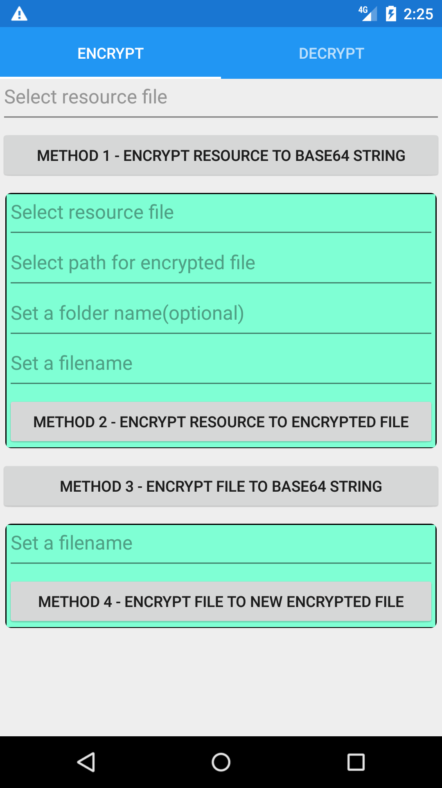
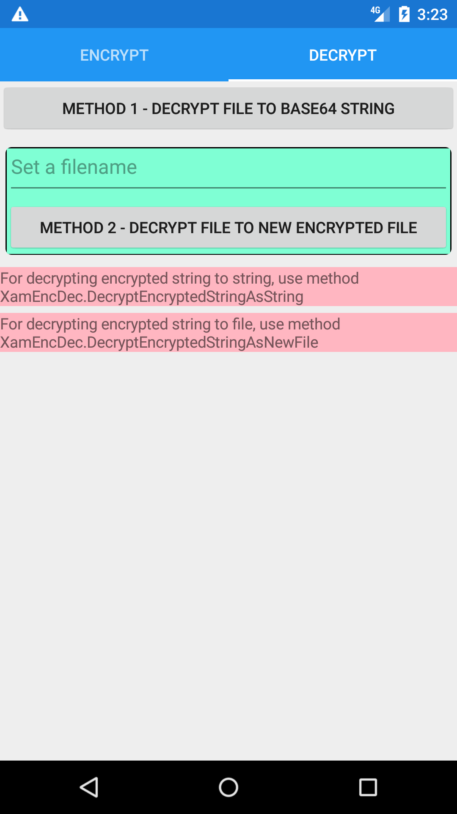

# XamarinEncryptorDecryptor
Encryption and Decryption for Xamarin Using AES

<p float="left">


</p>

Encryptor and Decryptor for Xamarin using AES

This plugin is to ease developer to implement encryption and decryption in xamarin

Note: All of your projects under a solution must be using Xamarin Forms 3.3.0.912540 or later
All projects must be using the same version of Xamarin Forms if not, there will be token error

After installing the plugin into your project from nuget: https://www.nuget.org/packages/Plugin.XamarinFileEncryptorDecryptor/1.0.0#

**Note: Password used for decryption must be the same as decryption.
          Decrypting a decrypted file or encrypting an encrypted file will cause error.**

**Check out the sample project on how to use the plugin here: https://github.com/magiciangambit/XamarinEncryptorDecryptor**

1. Gain some infos on getting or creating the path for encrypting or decrypting files
    You can get some info on this from the sample code, below are some examples:
    
```

            //For using application directory - no direct access to user
            localPath = XamEncDec.GetLocalPath();

            //For using roaming directory - not all platform support this
            roamingPath = XamEncDec.GetRoamingPath();

            //For using external storage path in Android
            androidSDPath = "";
            if (Device.RuntimePlatform == Device.Android)
                androidSDPath = CrossXamarinFileEncryptorDecryptor.Current.GetAndroidExternalStoragePath();

            //For using shared document path - commonly for iOS
            documentPath = XamEncDec.GetDocumentsPath();

            //For using library path in iOS
            libraryPath = "";
            if (Device.RuntimePlatform == Device.iOS)
                libraryPath = Path.Combine(Environment.GetFolderPath(Environment.SpecialFolder.MyDocuments), "..", "Library");

            //Other paths that you can use, theres more if you google
            localAppDataPath = Environment.GetFolderPath(Environment.SpecialFolder.LocalApplicationData);
            commonAppDataPath = Environment.GetFolderPath(Environment.SpecialFolder.CommonApplicationData);
            commonDocPath = Environment.GetFolderPath(Environment.SpecialFolder.CommonDocuments);
```

2. Use methods below for encryption and decryption:

```
public async void EncryptResourceFileToBase64String(Assembly assembly, string resourceName, string password)
        {
            //eg. encrypt resource file and generate encrypted Base64 string

            //XamEncDec.EncryptResourceFileAsBase64String(<Assembly object>, 
                                                    //<Resource filename>, <password>);
            var encryptedString = await XamEncDec.EncryptResourceFileAsBase64String(assembly, "TestFileEncryptDecryptXamarin.Files.MARBLES.JPG", "myPassword");
        }       

        public async void EncryptResourceFileToNewFile()
        {
            //eg. encrypt resource file and generate a new encrypted file 

            //XamEncDec.EncryptResourceFileAsNewFile(<Assembly object>, <Resource filename>, 
                        //<True=local directory,False=use custom path>,<set string for custom path>,
                                                    //<new/existing folder name>,<new filename>, <password>);
            var isFileEncrypted = await XamEncDec.EncryptResourceFileAsNewFile(assembly, "TestFileEncryptDecryptXamarin.Files.MARBLES.JPG",true,"","folderName1","MARBLES.JPG", "myPassword");
        }

        public async void EncryptFileToBase64String()
        {
            //eg. encrypt a file and generate encrypted base64 string

            //XamEncDec.EncryptFileAsBase64String(<true/false to delete source file>, 
            //<True=local directory,False=use custom path>, <set string for custom path>, 
            //<new/existing folder name>, <file name to be encrypted>, <password for encryption>);
            var encryptedString = await XamEncDec.EncryptFileAsBase64String(false, true, "", "folderName2", "MARBLES.JPG", "myPassword");
        }

        public async void EncryptFileToNewFile()
        {
            //eg. encrypt a file and generate new encrypted file

            //XamEncDec.EncryptFileAsNewFile(<true/false to delete source file>, 
            //<True=local directory,False=use custom path>, <set string for custom path>, 
            //<new/existing folder name>, <file name to be encrypted>, <password for encryption>,
            //<new file name for encrypted file>);
            bool isFileEncrypted = false;
            if (Device.RuntimePlatform == Device.Android)
            {
                isFileEncrypted = await XamEncDec.EncryptFileAsNewFile(false, false,
                    CrossXamarinFileEncryptorDecryptor.Current.GetAndroidExternalStoragePath(), 
                    "folderName1", "MARBLES.JPG", "myPassword", "MARBLES_ENCRYPTED.JPG");                    
            }
            
        }

        public async void DecryptEncryptedString(string encryptedString)
        {
            //eg. decrypt encrypted Base64 string

            //XamEncDec.DecryptEncryptedStringAsBase64String(<encrypted string>, <password used for encryption>);
            var decryptedString = await XamEncDec.DecryptEncryptedStringAsString(encryptedString, "myPassword");
        }

        public async void DecryptEncryptedStringToNewFile(string encryptedString)
        {
            //eg. decrypt encrypted string to a new file

            //XamEncDec.DecryptEncryptedStringAsNewFile(<True=local directory,False=use custom path>, 
            //<set string for custom path>, <folder name for output>, <encrypted Base64 string>, 
            //<new filename for decrypted file>, <password used for encryption>);
            var isFileDecrypted = await XamEncDec.DecryptEncryptedStringAsNewFile(false, androidSDPath, "test7", encryptedString, "test1.jpg", "myPassword");
        }

        public async void DecryptEncryptedFileToNewFile()
        {
            //eg. decrypt encrypted file to a new file

            //XamEncDec.DecryptFileAsNewFile(<True=local directory,False=use custom path>, 
            //<set string for custom path>, <folder name for output>, <encrypted filename>, 
            //<password used for encryption>, <new filename for decrypted file>);
            var isFileDecrypted = await XamEncDec.DecryptFileAsNewFile(true, "", "folderName1", "MARBLES_ENCRYPTED.JPG", "myPassword", "MARBLES_DECRYPTED.JPG");
        }


```

